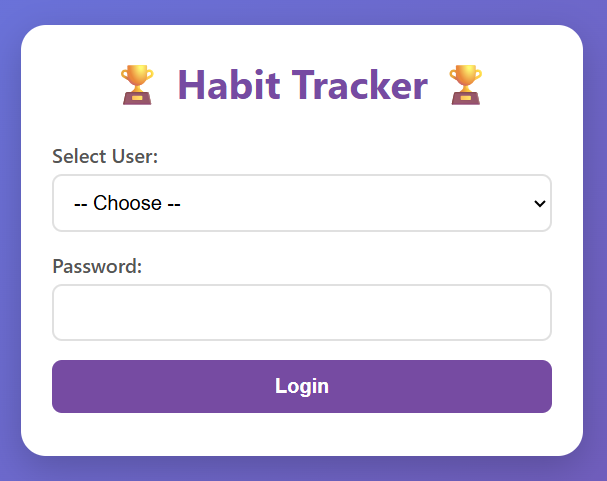
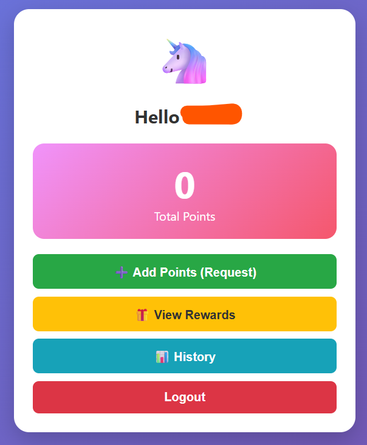
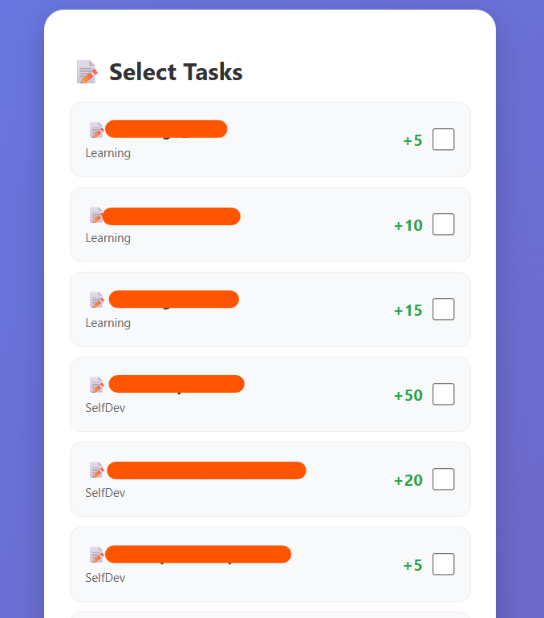
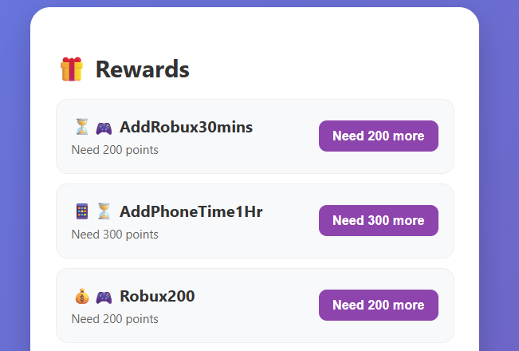
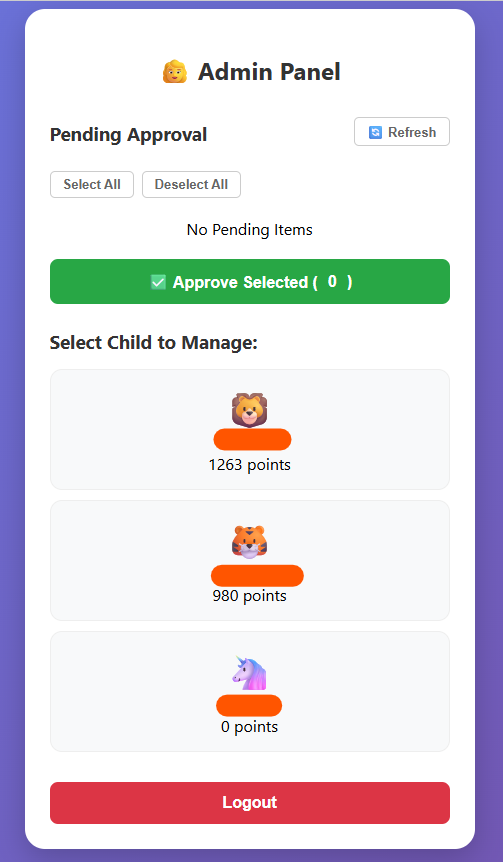

# 🏆 Gamified Habit Tracker & Reward Web App

A behavior management and reward system designed for families, built with **Google Apps Script** and **Google Sheets**.

---

## 🌟 Overview
This project is a gamified approach to fostering discipline within the household. Users (children) earn points by completing assigned tasks, which can then be redeemed for rewards. The system features a centralized **Admin Panel** for parents to manage points, approve multiple requests at once, and track progress efficiently.

### 🔑 Access Control

---

## ✨ Key Features

### 👤 User Dashboard
* **Real-time Balance:** Displays current total points instantly.
* **Transaction History:** A detailed log of all point earnings and redemptions.
* **Multi-Task Selection:** Users can select and submit multiple task requests in a single batch to streamline the process.

### 🎁 Dynamic Reward System
* **Card-based UI:** A modern interface showcasing all available rewards.
* **Smart Logic:** Automatically calculates point sufficiency, toggling between a **"Claim!"** button and a **"Need more points"** status indicator.

### 🔐 Advanced Admin Panel
* **Bulk Approval System:** Admins can approve or reject multiple point requests simultaneously using "Select All" functionality.
* **Individual Child Management:** * View specific profiles and current balances.
    * **Penalty System:** Deduct points for misbehavior with a mandatory "reason for log" requirement for transparency.
* **Responsive UI:** Fully optimized for a seamless experience on both **Desktop and Mobile** devices.

* **User Dashboard:**
* 

* **Multi-Task Selection:**
* 

* **Dynamic Reward System:**
* 

* **Advanced Admin Panel:**
* 

---

## 🚀 Tech Stack

| Component | Technology |
| :--- | :--- |
| **Backend** | Google Apps Script (JavaScript V8 Runtime) |
| **Database** | Google Sheets (Lightweight NoSQL structure) |
| **Frontend** | HTML5, CSS3, JavaScript |
| **Styling** | Custom CSS with Responsive Grid Layout |

---

## 🔧 Setup Instructions

1.  **Prepare Database:** Create a Google Sheet with the following sheet names: `Users`, `Tasks`, `Rewards`, and `PointsLog`.
2.  **Access Script Editor:** Open your sheet and go to **Extensions** > **Apps Script**.
3.  **Upload Code:** Copy the contents of `Code.gs` and `index.html` from this repository into the respective files in the editor.
4.  **Configure ID:** Replace the `SHEET_ID` variable in `Code.gs` with your actual Spreadsheet ID (found in the URL of your Google Sheet).
5.  **Deployment:** * Click **Deploy** > **New Deployment**.
    * Select **Web App**.
    * Set access to **"Anyone"**.
    * Authorize the necessary permissions.

* ภาษาไทย* :
# 🏆 Habit Tracker & Reward Web App
ระบบติดตามพฤติกรรมและแลกรางวัลสำหรับครอบครัว พัฒนาด้วย Google Apps Script และ Google Sheets

## 🌟 Overview
โปรเจกต์นี้ถูกสร้างขึ้นเพื่อช่วยสร้างวินัยผ่านการสะสมคะแนนจากการทำภารกิจ (Tasks) และนำคะแนนมาแลกรางวัล (Rewards) โดยมีระบบ Admin (ผู้ปกครอง) สำหรับตรวจสอบและอนุมัติคำขอแบบกลุ่ม (Bulk Approval)

## ✨ Key Features
- **User Dashboard:** แสดงคะแนนปัจจุบันและประวัติการรับคะแนน
- **Multi-Task Selection:** ผู้ใช้สามารถเลือกส่งคำขอคะแนนได้หลายภารกิจพร้อมกันในครั้งเดียว
- **Dynamic Reward System:** แสดงรายการรางวัลพร้อมสถานะ "Claim" หรือแจ้งคะแนนที่ขาดหาย
- **Admin Panel:**
    - ระบบอนุมัติหรือปฏิเสธคำขอแบบรายบุคคลและแบบกลุ่ม (Select All / Bulk Approval)
    - ระบบจัดการเด็กรายบุคคล แสดงคะแนนปัจจุบันและระบบหักคะแนน (Deduct Points) พร้อมระบุเหตุผล
- **Responsive Design:** รองรับการใช้งานทั้งบนคอมพิวเตอร์และมือถือ

## 🚀 Tech Stack
- **Backend:** Google Apps Script (Javascript V8 Runtime)
- **Database:** Google Sheets
- **Frontend:** HTML5, CSS3, JavaScript
- **Styling:** Custom CSS with Responsive Grid Layout

## 🔧 Setup Instructions
1. สร้าง Google Sheets และเตรียมชีตชื่อ: `Users`, `Tasks`, `Rewards`, `PointsLog`
2. ไปที่ `Extensions` > `Apps Script`
3. คัดลอกโค้ดจาก `Code.gs` และ `index.html` ไปวาง
4. นำ ID ของ Google Sheets มาใส่ในตัวแปร `SHEET_ID`
5. กด `Deploy` > `New Deployment` เลือกประเภทเป็น `Web App`
